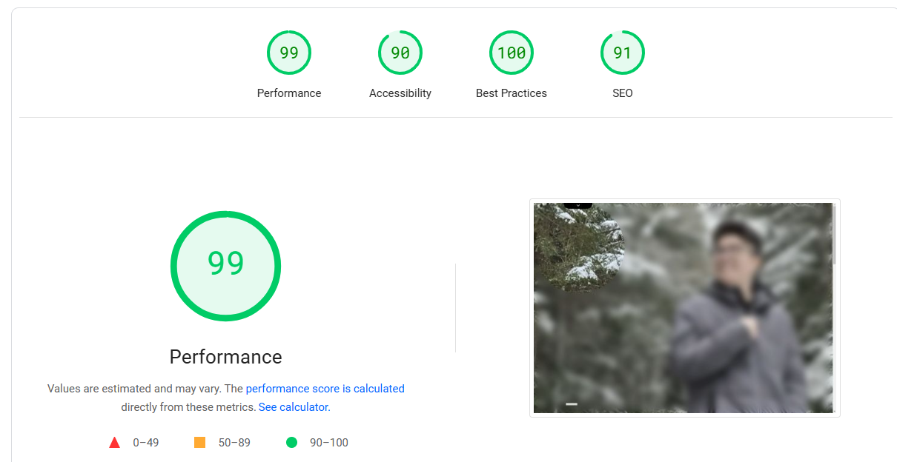

# Rafael Nagai – Portfolio Website

This repository contains the source code of my personal portfolio website, built to showcase my skills, projects, and professional background.  
🔗 [Visit the website](https://rafael-nagai.vercel.app/)

## 🛠️ Technologies Used

- **React + Vite** – Fast and modern development setup.
- **TypeScript** – For type safety and better development experience.
- **Sass (SCSS)** – CSS preprocessor for better style organization.
- **BEM Methodology** – Block Element Modifier structure for clear and scalable class naming.
- **Clean Code & Clean Architecture** – Focused on maintainability, reusability, and separation of concerns.

## 📊 Lighthouse Report

Here’s the Lighthouse performance audit from my portfolio website:



## 📁 Project Structure

The project is organized following clean architecture principles and modular components:

```
awesome-portifolio/
├── public/
├── src/
│   ├── assets/         # Images, icons, etc.
│   ├── components/     # Reusable components
│   ├── pages/          # Website pages
│   ├── styles/         # SCSS styles using BEM
│   ├── App.tsx         # Root component
│   └── main.tsx        # Entry point
├── package.json
├── tsconfig.json
└── vite.config.ts
```

## ✨ Features

- **Fully Responsive** – Looks great on all devices.
- **Accessible** – Built with best practices for usability and semantic HTML.
- **High Performance** – Optimized with lazy loading and code splitting.
- **Minimal & Modern Design** – Clean interface focused on content.
- **Scalable Codebase** – Easy to maintain and extend.

## 🚀 Getting Started

To run the project locally:

```bash
git clone https://github.com/RafaelNagai/awesome-portifolio.git
cd awesome-portifolio
npm install
npm run dev
```

Then open `http://localhost:3000` in your browser.

## 📬 Contact

If you have any feedback or suggestions, feel free to reach out via my [website](https://rafael-nagai.vercel.app/).  
Thanks for visiting! 👋

---

Built with passion and precision 💻✨
